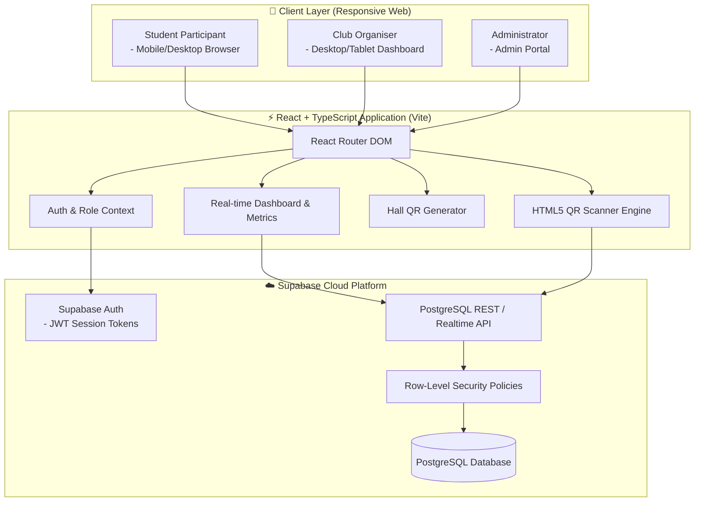
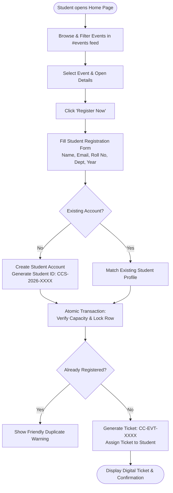
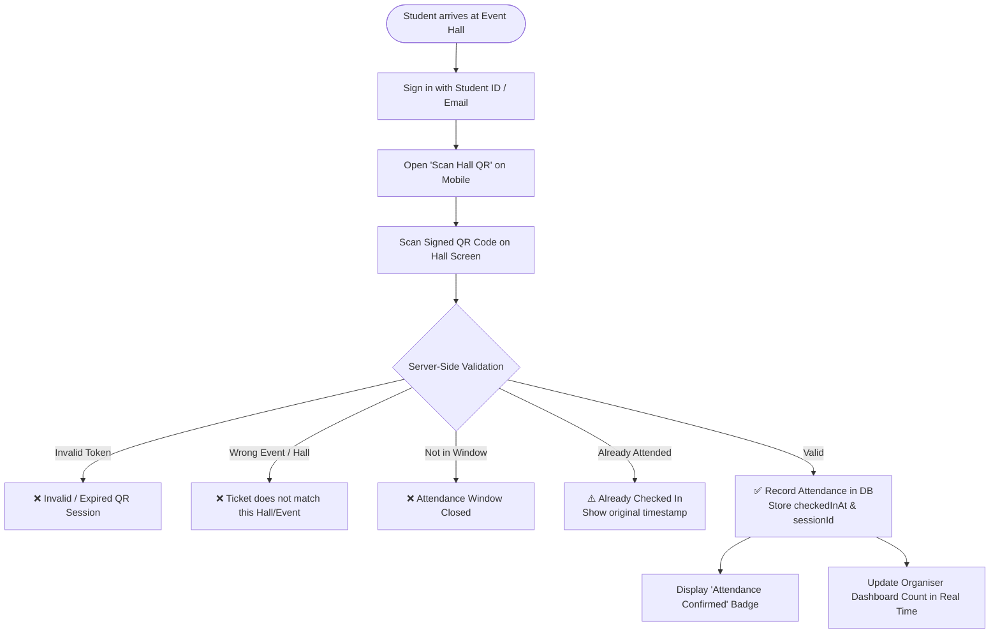
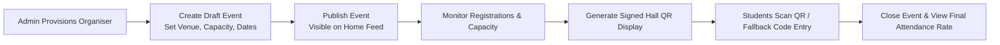
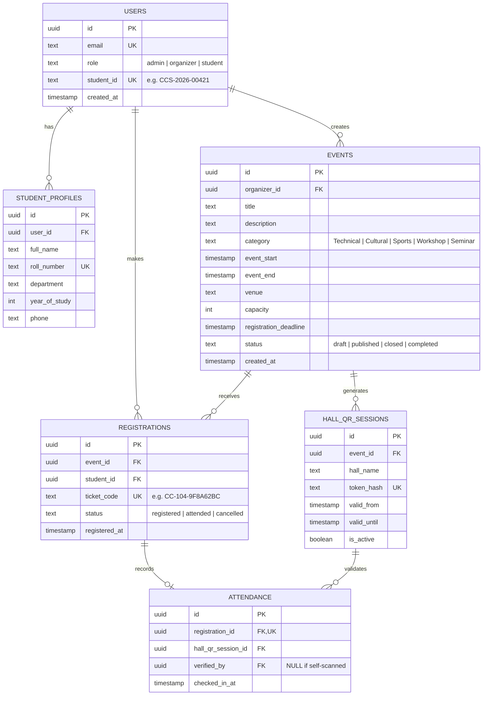

# 🎓 CampusConnect

### **Campus Event Management and Registration Portal**
*A centralized, secure, and modern event lifecycle platform for colleges and universities.*

[](https://github.com)
[](https://github.com)
[](https://github.com)
[](https://github.com)

---

## 👥 Team Details

| Team Member | Roll / Register No. | Role & Responsibility |
| :--- | :--- | :--- |
| **Abilash Kumar R** | `73152413003` | **Frontend Architecture & Student Experience**<br>• Scrollable Home feed, Event Discovery & Details<br>• Student Registration Form & Digital Ticket UI |
| **Devaroopa E** | `73152413035` | **Organiser Suite & Verification Engine**<br>• Organiser & Admin Dashboards, Analytics Metrics<br>• Hall QR Attendance Scanner & Verification Logic |
| **Cyril Christopher J** | `73152413029` | **Backend, Database & Security Lead**<br>• Supabase Schema, Relational Integrity & RLS Policies<br>• Authentication, Role-based Access & API Contract |

---

## 📌 Problem Statement

### **Context & Current Challenges**
College clubs, student chapters, and administrative bodies frequently organize technical symposiums, cultural fests, workshops, and sports meets. However, event coordination remains highly fragmented:
- **Scattered Discovery:** Events are promoted across disparate WhatsApp groups, Instagram stories, and printed flyers, leading to poor visibility and missed deadlines.
- **Messy Registrations:** Using generic forms (e.g., Google Forms) leads to duplicate registrations, unmanaged capacity limits, and lack of real-time seat tracking.
- **Entry Bottlenecks:** Venue check-ins rely on physical name sheets or screenshot inspections, causing long queues, entry disputes, and proxy check-ins.
- **Zero Visibility:** Organisers and faculty lack live insight into attendance rates, capacity utilization, and participant demographics.

### **The CampusConnect Solution**
**CampusConnect** transforms campus event management into a unified digital pipeline:
> **Admin provisions Organisers ➔ Organiser publishes Event with capacity ➔ Student discovers & registers (receives unique Student ID + Ticket) ➔ Student checks in on event day by scanning the signed Hall QR code ➔ Live Attendance Dashboard updates instantly.**

---

## 🚀 Key Features

* **🌟 Single-Page Scrollable Event Discovery:** Seamless home feed with live search, category filtering, remaining seat indicators, and dynamic status badges (`Open`, `Almost Full`, `Closed`).
* **🆔 Campus Student Identity & Digital Tickets:** First-time registration automatically issues a permanent CampusConnect Student ID (`CCS-2026-XXXXX`) and a unique cryptographic Ticket Code (`CC-{EVENT_ID}-{RANDOM}`).
* **🛡️ Strict 3-Tier Role-Based Access Control (RBAC):** Zero public staff registration. Admins provision Organisers; Organisers manage their events; Students register and check in.
* **📱 Secure Hall-Specific QR Attendance:** Students check in by scanning the dynamic, cryptographically signed QR code displayed inside the event hall.
* **⚡ Idempotent Check-in & Database Constraints:** Database-level uniqueness constraints eliminate duplicate registrations and duplicate attendance records.
* **📊 Organiser Analytics Dashboard:** Real-time visibility into total registrations, capacity percentage, check-in count, and attendance conversion rates.
* **🔄 Organiser Manual Fallback:** Organisers can search by Ticket Code or Student ID for manual verification if student devices have camera/battery issues.

---

## 🛠️ Technology Stack

| Layer | Technology | Purpose & Rationale |
| :--- | :--- | :--- |
| **Frontend Framework** | **React 18 / TypeScript** | Declarative component UI, robust type safety, and fast client-side state management. |
| **Build & Tooling** | **Vite** | Blazing-fast Hot Module Replacement (HMR) and optimized production bundles. |
| **Styling & Design** | **Tailwind CSS** | Clean campus-utility design system with responsive layouts and dark/light accents. |
| **Icons & Assets** | **Lucide React** | Modern, lightweight, and accessible icon primitives. |
| **Database** | **PostgreSQL (via Supabase)** | Relational data integrity, unique constraints, foreign keys, and ACID compliance. |
| **Authentication & RLS** | **Supabase Auth & RLS** | Secure JWT-based session handling and Row-Level Security policy enforcement. |
| **QR Code Engine** | **`html5-qrcode` & `qrcode.react`** | High-speed mobile camera scanning and high-contrast hall QR token generation. |
| **Hosting & CI/CD** | **Vercel / GitHub Actions** | Global CDN distribution, automated preview deployments, and zero-downtime releases. |

---

## 🏛️ System Architecture

### **1. High-Level Architecture Overview**


---

### **2. Core User Flows**

#### **A. Student Discovery & Registration Journey**


#### **B. Event-Day Hall QR Attendance Verification**


#### **C. Organiser Event Lifecycle**


---

## 🗄️ Database Schema & Data Integrity

### **Entity-Relationship Diagram (ERD)**



### **Database Integrity & Concurrency Constraints**
To prevent race conditions, overselling, and duplicate entries at the database layer:

```sql
-- 1. Prevent duplicate registrations for the same event by a student
ALTER TABLE registrations 
ADD CONSTRAINT unique_event_student_registration 
UNIQUE (event_id, student_id);

-- 2. Enforce global ticket code uniqueness
ALTER TABLE registrations 
ADD CONSTRAINT unique_ticket_code 
UNIQUE (ticket_code);

-- 3. Idempotent attendance: one check-in per registration
ALTER TABLE attendance 
ADD CONSTRAINT unique_single_attendance 
UNIQUE (registration_id);

-- 4. Identity uniqueness constraints
ALTER TABLE users ADD CONSTRAINT unique_user_email UNIQUE (email);
ALTER TABLE users ADD CONSTRAINT unique_student_id UNIQUE (student_id);
ALTER TABLE student_profiles ADD CONSTRAINT unique_student_roll_number UNIQUE (roll_number);
```

---

## 🗺️ Application Route Map

| Route | Page / View | Access Level | Description |
| :--- | :--- | :--- | :--- |
| `/` | **Home Page** | Public | Branded landing hero, search & filters, and scrollable all-events feed (`#events`). |
| `/events/:id` | **Event Details** | Public | Complete event info, venue, remaining capacity bar, and "Register" CTA. |
| `/events/:id/register` | **Student Registration** | Public / Student | Comprehensive form collecting student info, auto-generating Student ID & Ticket. |
| `/student/login` | **Student Portal Sign-In** | Public | Student ID/Email and password authentication. |
| `/my-registrations` | **My Tickets** | Authenticated Student | View active/past tickets, status badges, and launch attendance scanner. |
| `/ticket/:id` | **Digital Ticket** | Authenticated Student | High-contrast mobile ticket with Ticket Code, Student ID, and QR. |
| `/attendance/scan` | **Hall QR Scanner** | Authenticated Student | Live mobile camera scanner to check in by scanning the venue QR. |
| `/organizer` | **Organiser Dashboard** | Organiser / Admin | Real-time analytics, event list, capacity tracking, and participant roster. |
| `/organizer/events/new` | **Create Event** | Organiser / Admin | Event creation form with capacity limits, venue selection, and deadlines. |
| `/organizer/events/:id/hall-qr` | **Hall QR Display** | Organiser / Admin | Full-screen dynamic signed QR code for projector/display at the hall entrance. |
| `/organizer/events/:id/verify` | **Manual Check-In** | Organiser / Admin | Fallback search by Ticket Code / Student ID for manual verification. |
| `/admin` | **Admin Dashboard** | Admin Only | Provision Organiser & Admin accounts; platform-wide oversight. |

---

## 🔒 Security & Privacy Architecture

1. **Zero-Trust Staff Provisioning:** No public sign-up for Organiser or Admin roles. All staff accounts must be explicitly provisioned by a Super Admin.
2. **Cryptographic Hall QR Sessions:** Hall QR codes do not embed raw database IDs. They contain an encrypted/signed token with a restricted validity window bound to the specific event venue.
3. **Data Minimization:** QR codes never store student phone numbers, email addresses, or personal credentials. Verification requests only expose necessary operational details.
4. **Row-Level Security (RLS):** Supabase RLS ensures students can only read/update their own registrations, while organisers can only view and manage events they created.

---

## 💻 Folder Structure

```
CampusConnect/
├── frontend/                     # Client-side React + TypeScript Application
│   ├── public/                   # Static public assets
│   │   └── assets/               # Logos, icons & imagery
│   └── src/
│       ├── components/           # Reusable UI component modules
│       │   ├── dashboard/        # MetricsGrid, MetricCard, ParticipantTable
│       │   ├── events/           # EventCard, EventGrid, CapacityBar
│       │   ├── layout/           # AppShell, Navbar, Footer, MobileNav
│       │   ├── scanner/          # CameraScanner, HallQRDisplay, VerificationBadge
│       │   ├── tickets/          # DigitalTicket, TicketCard, TicketQR
│       │   └── ui/               # Button, Input, Modal, Card, Badge, Table
│       ├── context/              # React Context Providers (AuthContext, ThemeContext)
│       ├── hooks/                # Custom React client hooks
│       ├── pages/                # Page route views
│       │   ├── admin/            # Admin staff-provisioning dashboard
│       │   ├── organizer/        # Organiser event management & metrics
│       │   ├── public/           # Scrollable HomePage & EventDetailsPage
│       │   └── student/          # StudentLoginPage, MyRegistrationsPage, TicketPage
│       ├── routes/               # Client-side route configuration & guards
│       ├── services/             # API client fetchers & Supabase client
│       ├── types/                # Frontend TypeScript models & interfaces
│       └── utils/                # Date/time formatters, validators & helpers
│
├── backend/                      # Server-side API & Database Logic
│   ├── config/                   # Environment & server configurations
│   ├── controllers/              # Request handlers (Auth, Events, Attendance)
│   ├── database/                 # Database schema definitions & migrations
│   │   ├── migrations/           # SQL migration scripts (PostgreSQL / Supabase)
│   │   └── seeds/                # Initial demo seeds (Admin, Organisers, Events)
│   ├── middleware/               # Auth guards, role verification & rate-limiting
│   ├── models/                   # Database entity models & schemas
│   ├── routes/                   # API endpoint route declarations
│   ├── services/                 # Backend business logic services
│   │   ├── attendance/           # Idempotent check-in verification
│   │   ├── auth/                 # Authentication & token verification
│   │   ├── events/               # Event publishing & capacity verification
│   │   ├── qr/                   # Cryptographic signed QR token generator
│   │   └── registration/         # Atomic registration & ticket generation
│   ├── types/                    # Backend TypeScript interfaces & DB types
│   └── utils/                    # Hash generators, validators & response helpers
│
├── .env                          # Local environment secrets (ignored by git)
├── .gitignore                    # Git ignore rules
├── CampusConnect.md              # Revised Product Requirements Document
├── campusconnect1.md             # Initial Product Requirements Document
└── README.md                     # Project documentation & architecture plan
```

---

## ⚡ Getting Started & Local Setup

### **Prerequisites**
- **Node.js**: `v18.x` or higher
- **npm** or **pnpm** / **yarn**
- **Supabase Account** (or local Supabase CLI instance)

### **1. Clone the Repository**
```bash
git clone https://github.com/cyrilchris-j/College-Event-Management.git
cd College-Event-Management
```

### **2. Install Dependencies**
```bash
npm install
```

### **3. Configure Environment Variables**
Create a `.env` file in the root directory and add your Supabase credentials:
```env
VITE_SUPABASE_URL=https://your-project-id.supabase.co
VITE_SUPABASE_ANON_KEY=your-anon-key-here
```

### **4. Run Database Migrations**
Run the SQL schema scripts provided in the `supabase/migrations/` directory inside your Supabase SQL Editor to set up tables, constraints, and Row-Level Security policies.

### **5. Start the Development Server**
```bash
npm run dev
```
Open [http://localhost:5173](http://localhost:5173) in your browser.

---

## 📈 Future Roadmap

- [ ] **Phase 2 (Campus Operations):** Automated digital certificate generation with verifiable QR codes upon event completion.
- [ ] **Phase 3 (Student Engagement):** Automated waitlisting when events reach capacity, triggering automated seat allocation upon cancellations.
- [ ] **Phase 4 (Offline Check-in):** Offline local storage caching for entry volunteers in low-connectivity underground auditoriums.
- [ ] **Phase 5 (Multi-College Federation):** Inter-college fest registration supporting external college student verification.

---

## 📜 License & Acknowledgements

Developed for the **College Hackathon — Problem Statement RWW-8 (Campus Event Management and Registration Portal)**.

*Designed and engineered with passion by **Abilash Kumar R**, **Devaroopa E**, and **Cyril Christopher J**.*
